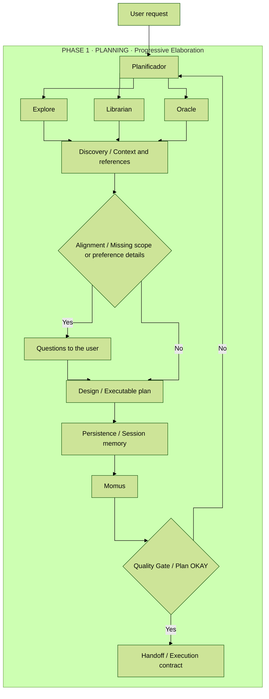
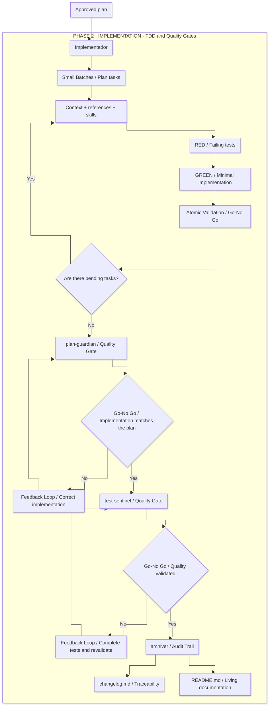

# Agent System

This system splits work into two phases to reduce improvisation and make every change auditable:

- **Planning**: defines the work, constraints, exact files, and test strategy before touching code.
- **Implementation**: executes the approved plan with TDD, validates the result, and passes final audits.

The core idea is that the system should not depend on an agent "being good at improvising". Planning reduces ambiguity, implementation reduces drift, and final audits reduce regressions and shortcuts.

## Key Principles

This system is not only meant to produce changes, but to produce **explainable, auditable, and repeatable** changes. To do that, it applies a small set of very concrete engineering rules:

- **Contract-first execution**: approve an executable plan first, then implement it.
- **Decision-complete handoff**: one phase must not pass ambiguity to the next; if names, layers, references, or commands are missing, the handoff is wrong.
- **Separation of concerns**: each agent answers a different question: design, execute, audit production code, audit tests, or archive.
- **TDD and shift-left quality**: quality starts before touching production code, not after.
- **Evidence-based validation**: "it looks correct" is not enough; you need a plan, a diff, tests, and real commands.
- **Traceability end to end**: the change must be traceable from the request all the way to `changelog.md`.

Methodologically, the flow combines specification by contract, stage gates, architecture governance, and audit trail engineering in a single pipeline.

It also uses classic software engineering and delivery concepts such as **progressive elaboration**, **quality gates**, **go/no-go decisions**, **independent verification**, **risk-based specialization**, and **traceable execution**.

## Phase 1: Planning

The planning phase is orchestrated by **Planificador**. Its job is not to code, but to turn a request into an executable and verifiable plan.

- **Explore** locates routes, files, patterns, and entry points.
- **Librarian** provides documentation, signatures, and examples when technical context is needed.
- **Oracle** sets architecture decisions, layer boundaries, and testing strategy.
- **Momus** reviews the final plan and decides whether the handoff to implementation is free of ambiguity.

### What Planificador Actually Does

Planificador acts like an execution designer. Before producing a plan, it classifies the request to decide the level of depth required:

- **Trivial**: small and obvious change.
- **Standard**: normal feature, bugfix, or refactor with several moving parts.
- **Architecture**: cross-cutting or structural change; Oracle is mandatory here.

It then follows a fixed workflow:

1. **Discovery**: explores the repository and looks for real references before asking the user anything.
2. **Alignment**: asks questions only when preferences, tradeoffs, or product decisions are missing.
3. **Design**: builds a detailed plan with atomic tasks, exact files, tests, constraints, and commands.
4. **Persistence**: keeps the plan alive in session memory so the system can resume context without repeating the analysis.
5. **Review**: sends the plan to Momus and does not consider it ready until it gets OKAY.

### Value of the Supporting Agents During Planning

- **Explore** avoids unnecessary questions because it finds existing patterns, routes, files, and entry points.
- **Librarian** reduces mistakes caused by stale knowledge when a decision depends on libraries, signatures, configuration, or breaking changes.
- **Oracle** protects the architecture: it defines what each layer should do, what must not be mixed, and how it should be tested.
- **Momus** does not improve the design for style points; it checks whether Implementador will be able to execute the plan without inventing names, steps, or validations.

In this phase, the important output is not code. It is a plan with exact files, ordered tasks, required skills, [RED] tests, [GREEN] implementation steps, references, and validation commands.

### Engineering Concepts Present

- **Discovery-driven planning** and **progressive elaboration**: investigate first, then make it concrete.
- **Specification by contract**: the plan defines files, constraints, dependencies, and validations before execution.
- **Architecture governance**: Oracle and the guardrails turn architecture into an active constraint.
- **Verification planning**: acceptance criteria and commands are defined before writing production code.

### What an Approved Plan Contains

A valid plan is not a generic list of ideas. It must lock down these points:

- **Goal and scope**: what is included and what is not.
- **Layer ownership**: domain, infrastructure, application, interface, and presentation.
- **Execution order**: which task blocks which other task.
- **Testing strategy**: which test is written first and which command validates it.
- **Concrete references**: existing files that define the pattern to follow.
- **Guardrails**: things the implementer must not do even if they look convenient.

In other words, the planning output is an **execution contract**, not an open proposal.

## Phase 2: Implementation

The implementation phase starts only when there is an approved plan. **Implementador** consumes that plan as a contract and should not invent names, layers, or validations.

- It reads the plan in a fixed order.
- It reviews references before editing.
- It applies the skills required by each task.
- It works with TDD: tests first, then code.
- It runs atomic validations for each task.
- It closes with two mandatory reviews and a final archive step: **plan-guardian**, **test-sentinel**, and **archiver**.

### What Implementador Actually Does

Implementador is optimized for execution, not redesign. Its first filter is to verify that the plan meets the contract required by the system:

- exact routes and files;
- skills invoked per task;
- [RED] and [GREEN] steps;
- `Must NOT do` restrictions;
- sufficient references;
- acceptance criteria with concrete commands;
- task dependency metadata.

If any of that is missing, it must stop and request a new planning step. That rule matters because it prevents the implementation phase from reopening decisions that should have been closed earlier.

### Internal Working Order

Implementador reads the plan in a deliberate order:

1. product requirements and business rules;
2. context and architecture decisions;
3. implementation handoff notes;
4. global guardrails;
5. execution strategy;
6. the specific task to execute.

That order avoids a common mistake: starting from the isolated task and missing global constraints that later get broken unintentionally.

### Task Execution Flow

Each task should go through this cycle:

1. read context, edge cases, and constraints;
2. check dependencies and blockers;
3. open repository references before editing;
4. apply the mandatory skills for the task;
5. write the [RED] tests;
6. run the tests and observe the expected failure when feasible;
7. implement only what is necessary to move to [GREEN];
8. run the atomic validation defined in the plan;
9. close the task only if it passes its acceptance criterion.

With this, Implementador does not work by intuition, but through a repeatable sequence.

In this phase, the expected result is code aligned with the plan, with validations actually executed, and with durable documentation: `changelog.md` always updated and `README.md` adjusted whenever the change makes the main project documentation obsolete.

### Mandatory Final Audits and Archiving

Implementation does not end when "everything compiles". The system requires two separate reviews and a final archive stage:

- **plan-guardian** audits the production code against the approved plan. It looks for drift such as invented files, badly connected layers, violated rules, or incomplete work relative to the handoff.
- **test-sentinel** audits the quality side. It checks that the requested tests exist, that the per-layer testing matrix was respected, and that there is execution evidence.
- **archiver** runs at the end, triggered by **Implementador** only when both reviewers have already returned OK for the current review. It converts the final context and a set of fixed-format Delta Specs into a `changelog.md` entry and, if reading `README.md` shows that the change made it obsolete, it updates that too. If the change alters a workflow or a handoff, it can load the repository Mermaid skill to generate and validate a diagram before archiving.

That separation is useful because it avoids mixing different questions:

- "Does the implemented code match the plan?"
- "Do the required tests exist and were they run correctly?"
- "Is there a verifiable and useful record of the already validated change?"

The system answers each question with a different agent. That separation reduces confirmation bias and turns change closure into a decision based on independent controls.

### Engineering Concepts Present

- **Strict TDD** and **small-batch execution**: each task moves in short RED -> GREEN -> validation cycles.
- **Atomic validation** and **go/no-go criteria**: a task is not closed unless it passes its concrete validation.
- **Quality gates** and **independent verification**: plan-guardian and test-sentinel audit from different angles.
- **Audit trail** and **evidence-based closure**: archiver documents the actual change with support from diff, files, and commands.

## Handoff Between Phases

The boundary between both phases is deliberate:

1. **Planificador** reduces uncertainty.
2. **Momus** blocks ambiguous or incomplete plans.
3. **Implementador** executes without reinterpreting the scope.
4. **plan-guardian** confirms that the code matches the plan.
5. **test-sentinel** confirms that the requested tests exist and were executed.
6. **archiver** leaves the change archived in `changelog.md` and keeps `README.md` up to date when the change affects the main project documentation.

In short, the system uses planning to lock decisions before editing and implementation to execute them with quality controls at the end. It works well only if the plan is truly executable, reviewers actually block issues, and documentation reflects the real change instead of the intention.

## Responsibility Summary

Viewed as a system, each agent covers a different risk:

- **Planificador**: ambiguity risk.
- **Explore**: risk of not understanding the repository.
- **Librarian**: risk of applying incorrect or outdated documentation.
- **Oracle**: risk of breaking architecture or testing strategy.
- **Momus**: risk of handing off a plan that cannot be executed without improvisation.
- **Implementador**: risk of inconsistent execution.
- **plan-guardian**: risk of drift between the plan and the real code.
- **test-sentinel**: risk of insufficient quality or incomplete TDD.
- **archiver**: risk of losing verifiable traceability once the validated change is finished.

That is why the system is richer than a simple "planner + coder": it is really a specialization chain where each agent narrows the margin of error before handing work to the next one.
