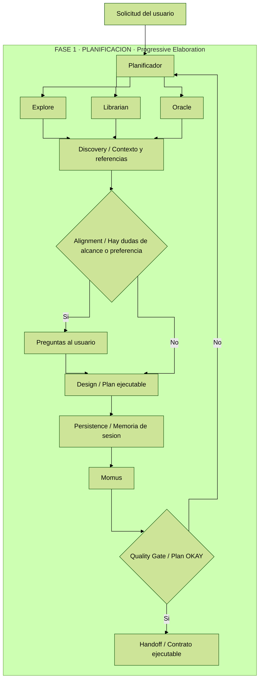
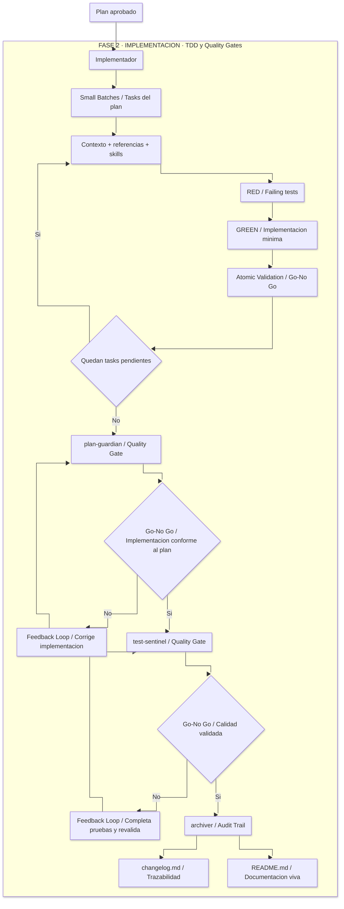

# Sistema de agentes

Este sistema separa el trabajo en dos fases para reducir improvisación y hacer cada cambio auditable:

- **Planificación**: define el trabajo, las restricciones, los archivos exactos y la estrategia de pruebas antes de tocar código.
- **Implementación**: ejecuta el plan aprobado con TDD, valida el resultado y pasa auditorías finales.

La idea de fondo es que el sistema no dependa de que un agente "improvise bien". La planificación reduce ambigüedad, la implementación reduce desviaciones y las auditorías finales reducen regresiones y atajos.

## Principios clave

Este sistema no busca solo producir cambios, sino producir cambios **explicables, auditables y repetibles**. Para eso aplica unas pocas reglas de ingeniería muy concretas:

- **Contract-first execution**: primero se aprueba un plan ejecutable y luego se implementa.
- **Decision-complete handoff**: una fase no le pasa ambigüedad a la siguiente; si faltan nombres, capas, referencias o comandos, el handoff está mal.
- **Separation of concerns**: cada agente responde a una pregunta distinta: diseñar, ejecutar, auditar producción, auditar tests o archivar.
- **TDD y shift-left quality**: la calidad empieza antes de tocar producción, no después.
- **Evidence-based validation**: no vale "parece correcto"; hacen falta plan, diff, tests y comandos reales.
- **Traceability end to end**: el cambio debe poder seguirse desde la petición hasta `changelog.md`.

En términos metodológicos, el flujo combina specification by contract, stage gates, architecture governance y audit trail engineering en un mismo pipeline.

También aparecen conceptos clásicos de ingeniería de software y delivery como **progressive elaboration**, **quality gates**, **go/no-go decisions**, **independent verification**, **risk-based specialization** y **traceable execution**.

## Fase 1: planificación

La fase de planificación está orquestada por **Planificador**. Su trabajo no es programar, sino convertir una petición en un plan ejecutable y verificable.

- **Explore** localiza rutas, archivos, patrones y puntos de entrada.
- **Librarian** aporta documentación, firmas y ejemplos cuando hace falta contexto técnico.
- **Oracle** fija decisiones de arquitectura, límites de capa y estrategia de pruebas.
- **Momus** revisa el plan final y decide si el traspaso a implementación está libre de ambigüedades.

### Qué hace realmente Planificador

Planificador actúa como un diseñador de ejecución. Antes de producir un plan, clasifica la petición para decidir la profundidad necesaria:

- **Trivial**: cambio pequeño y obvio.
- **Standard**: feature, bugfix o refactor normal con varias piezas.
- **Architecture**: cambio transversal o con impacto estructural; aquí Oracle es obligatorio.

Después recorre un flujo fijo:

1. **Discovery**: explora el repositorio y busca referencias reales antes de preguntar nada al usuario.
2. **Alignment**: solo pregunta cuando faltan preferencias, tradeoffs o decisiones de producto.
3. **Design**: construye un plan detallado con tareas atómicas, archivos exactos, pruebas, restricciones y comandos.
4. **Persistence**: mantiene el plan vivo en memoria de sesión para que el sistema pueda retomar contexto sin rehacer el análisis.
5. **Review**: envía el plan a Momus y no lo considera listo hasta recibir OKAY.

### Valor de los agentes auxiliares en planificación

- **Explore** evita preguntas innecesarias porque localiza patrones, rutas, archivos y puntos de entrada ya existentes.
- **Librarian** reduce errores por conocimiento obsoleto cuando una decisión depende de librerías, firmas, configuración o breaking changes.
- **Oracle** protege la arquitectura: define qué capa debe hacer cada cosa, qué no se puede mezclar y cómo debe probarse.
- **Momus** no mejora el diseño por gusto; comprueba si Implementador podrá ejecutar el plan sin inventar nombres, pasos o validaciones.

En esta fase la salida importante no es código: es un plan con archivos exactos, tareas por orden, skills requeridas, pruebas [RED], implementación [GREEN], referencias y comandos de validación.

### Conceptos de ingeniería presentes

- **Discovery-driven planning** y **progressive elaboration**: primero se investiga y luego se concreta.
- **Specification by contract**: el plan fija archivos, restricciones, dependencias y validaciones antes de ejecutar.
- **Architecture governance**: Oracle y los guardrails convierten la arquitectura en una restricción activa.
- **Verification planning**: los criterios de aceptación y comandos se definen antes de escribir producción.

### Qué contiene un plan aprobado

Un plan válido no es una lista genérica de ideas. Debe dejar cerrados estos puntos:

- **Objetivo y alcance**: qué entra y qué no entra.
- **Ownership por capas**: dominio, infraestructura, aplicación, interfaz y presentación.
- **Orden de ejecución**: qué tarea bloquea a cuál.
- **Estrategia de pruebas**: qué test nace primero y qué comando lo valida.
- **Referencias concretas**: archivos existentes que marcan el patrón a seguir.
- **Guardrails**: cosas que el implementador no puede hacer aunque parezcan convenientes.

En otras palabras: la salida de planificación es un **contrato de ejecución**, no una propuesta abierta.

## Fase 2: implementación

La fase de implementación empieza solo cuando existe un plan aprobado. **Implementador** consume ese plan como contrato y no debería inventar nombres, capas ni validaciones.

- Lee el plan en un orden fijo.
- Revisa referencias antes de editar.
- Aplica las skills exigidas por cada tarea.
- Trabaja con TDD: primero tests, luego código.
- Ejecuta validaciones atómicas por tarea.
- Cierra con dos revisiones obligatorias y un archivado final: **plan-guardian**, **test-sentinel** y **archiver**.

### Qué hace realmente Implementador

Implementador está optimizado para ejecutar, no para rediseñar. Su primer filtro es comprobar que el plan cumple el contrato exigido por el sistema:

- rutas y archivos exactos;
- skills invocadas por tarea;
- pasos [RED] y [GREEN];
- restricciones `Must NOT do`;
- referencias suficientes;
- criterios de aceptación con comandos concretos;
- metadatos de dependencia entre tareas.

Si eso no existe, debe detenerse y pedir un nuevo paso de planificación. Esa regla es importante porque evita que la fase de implementación reabra decisiones que deberían haberse cerrado antes.

### Orden interno de trabajo

Implementador lee el plan en un orden deliberado:

1. requisitos de producto y reglas de negocio;
2. decisiones de contexto y arquitectura;
3. notas de handoff para implementación;
4. guardrails globales;
5. estrategia de ejecución;
6. tarea concreta a ejecutar.

Ese orden evita un error común: empezar por la tarea aislada y perder restricciones globales que luego se rompen sin querer.

### Flujo de ejecución por tarea

Cada tarea debería recorrer este ciclo:

1. leer contexto, edge cases y restricciones;
2. comprobar dependencias y bloqueos;
3. abrir referencias del repositorio antes de editar;
4. aplicar las skills obligatorias de la tarea;
5. escribir los tests [RED];
6. ejecutar los tests y observar el fallo esperado cuando sea viable;
7. implementar solo lo necesario para pasar a [GREEN];
8. ejecutar la validación atómica definida en el plan;
9. cerrar la tarea solo si pasa su criterio de aceptación.

Con esto, Implementador no trabaja por intuición sino por una secuencia repetible.

En esta fase el resultado esperado es código alineado con el plan, con validaciones ejecutadas, y con documentación durable: `changelog.md` siempre actualizado y `README.md` ajustado cuando el cambio vuelva obsoleto la documentación principal del proyecto.

### Auditorías y archivado obligatorios al final

La implementación no termina cuando "todo compila". El sistema exige dos revisiones separadas y una etapa final de archivado:

- **plan-guardian** audita el código de producción contra el plan aprobado. Busca desvíos como archivos inventados, capas mal conectadas, reglas violadas o trabajo incompleto respecto al handoff.
- **test-sentinel** audita la parte de calidad. Comprueba que los tests pedidos existen, que se respetó la matriz de testing por capas y que hay evidencia de ejecución.
- **archiver** corre al final, lanzado por **Implementador** solo cuando ambos revisores ya devolvieron OK para la revisión actual. Convierte el contexto final y unos Delta Specs en formato fijo en una entrada de `changelog.md` y, si al leer el `README.md` detecta que el cambio lo dejó obsoleto, también lo ajusta. Si el cambio altera un flujo o un handoff, puede cargar la skill de Mermaid del repositorio para generar y validar un diagrama antes de archivarlo.

Esta separación es útil porque evita mezclar preguntas distintas:

- "¿el código implementado coincide con el plan?"
- "¿las pruebas exigidas existen y están bien ejecutadas?"
- "¿queda una huella verificable y útil del cambio ya validado?"

El sistema responde cada una con un agente diferente. Esa separación reduce sesgo de confirmación y convierte el cierre del cambio en una decisión basada en controles independientes.

### Conceptos de ingeniería presentes

- **Strict TDD** y **small-batch execution**: cada tarea avanza en ciclos cortos de RED -> GREEN -> validación.
- **Atomic validation** y **go/no-go criteria**: una tarea no se cierra si no supera su validación concreta.
- **Quality gates** e **independent verification**: plan-guardian y test-sentinel auditan desde ángulos distintos.
- **Audit trail** y **evidence-based closure**: archiver documenta el cambio real con soporte en diff, archivos y comandos.

## Traspaso entre fases

La frontera entre ambas fases es deliberada:

1. **Planificador** reduce incertidumbre.
2. **Momus** bloquea planes ambiguos o incompletos.
3. **Implementador** ejecuta sin reinterpretar el alcance.
4. **plan-guardian** confirma que el código coincide con el plan.
5. **test-sentinel** confirma que las pruebas pedidas existen y se han ejecutado.
6. **archiver** deja el cambio archivado en `changelog.md` y mantiene `README.md` al día cuando el cambio afecta la documentación principal del proyecto.

En resumen, el sistema usa la planificación para fijar decisiones antes de editar y la implementación para ejecutarlas con controles de calidad al final. Funciona bien solo si el plan es realmente ejecutable, los revisores bloquean de verdad y la documentación refleja el cambio real en vez de la intención.

## Resumen de responsabilidades

Visto como sistema, cada agente cubre un riesgo distinto:

- **Planificador**: riesgo de ambigüedad.
- **Explore**: riesgo de desconocer el repositorio.
- **Librarian**: riesgo de aplicar documentación incorrecta o desactualizada.
- **Oracle**: riesgo de romper arquitectura o testing strategy.
- **Momus**: riesgo de entregar un plan imposible de ejecutar sin improvisación.
- **Implementador**: riesgo de ejecución inconsistente.
- **plan-guardian**: riesgo de desviación entre plan y código real.
- **test-sentinel**: riesgo de calidad insuficiente o TDD incompleto.
- **archiver**: riesgo de perder trazabilidad verificable del cambio una vez validado.

Por eso el sistema es más rico que un simple "planner + coder": en realidad es una cadena de especialización donde cada agente estrecha el margen de error antes de pasar al siguiente.
